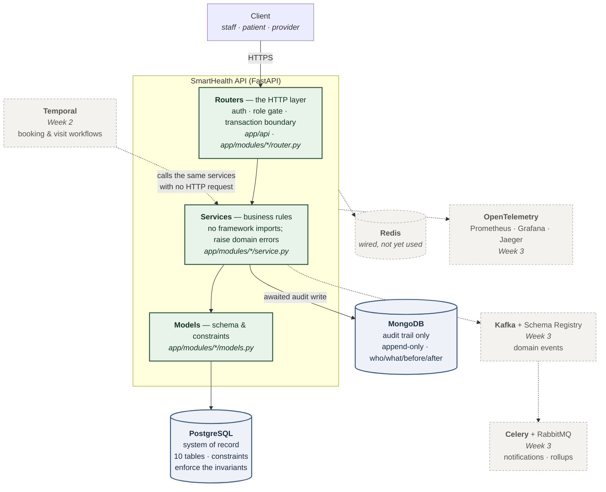
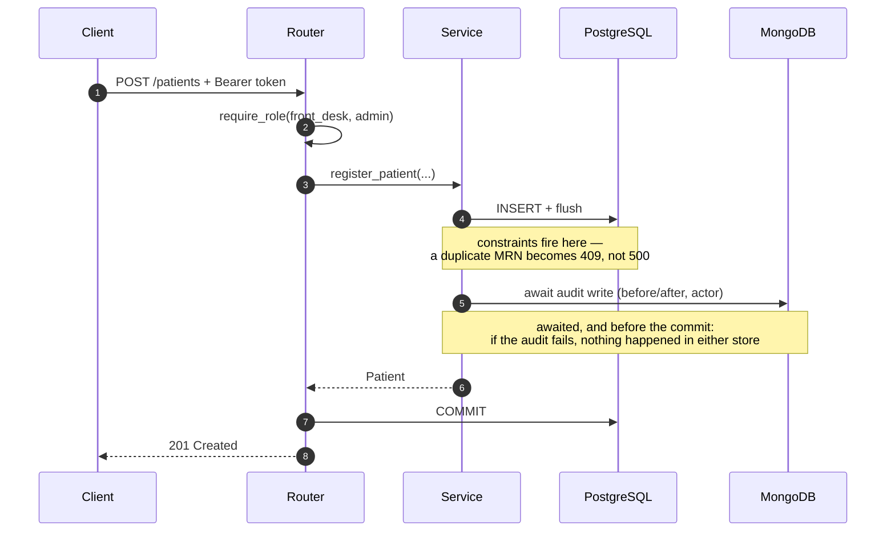
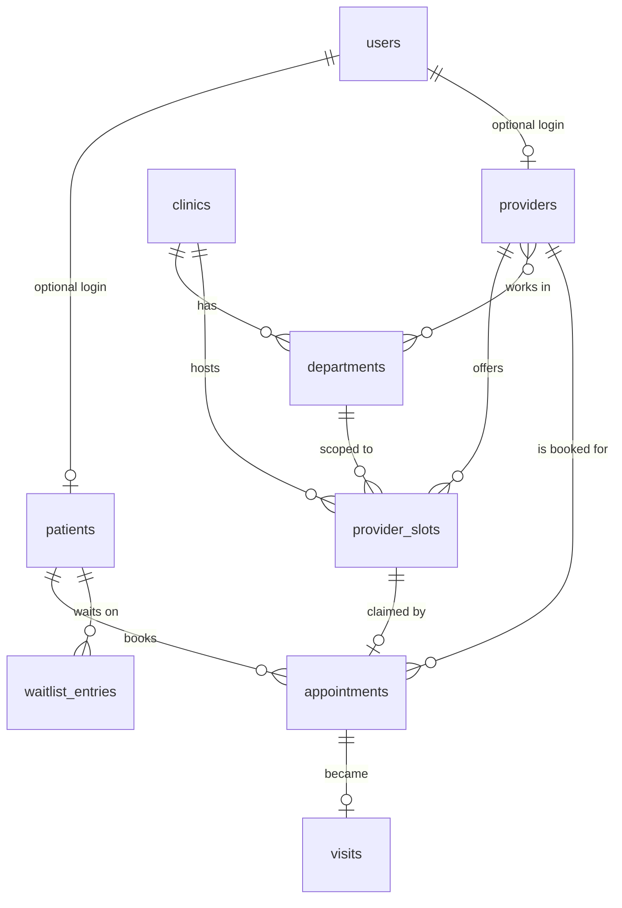

# SmartHealth

Intelligent Healthcare Operations & Patient Engagement Platform — a backend built for MediNova,
a fictional healthcare network, as a structured engineering assignment.

The project is delivered in two parts:

- **Part A — Core Platform** (Weeks 1–3): patient/provider management, appointment scheduling
  with durable workflows, visit lifecycle, event-driven background processing, observability.
- **Part B — GenAI Layer** (Weeks 4–5): operational data ingestion and embeddings, semantic
  retrieval, an AI healthcare assistant, generated patient communication, streaming responses.

## Status

**Week 1 complete.** Auth, patient and provider management, an audited mutation path,
a CLI to create the first user, and the application containerised behind a compose
profile. Week 2 adds scheduling. See [API surface](#api-surface) for what is callable
today.

## Architecture

Solid lines are wired and exercised by tests today; dashed lines are provisioned
infrastructure that no code connects to yet.



**This is a modular monolith, deliberately.** One deployable, one schema, one migration
history — and an import graph with a shape that two meta-tests enforce rather than
document. A plain monolith and a modular one are indistinguishable from the outside; the
only difference is whether anything may import anything, and here it may not.

**The layering rule** (vertical): services never import FastAPI. They raise domain errors that the
router layer translates to HTTP. That is what allows Week 2's Temporal activities to call
the same service functions from a worker process with no web request — and to distinguish
a permanent failure (*"the slot is taken"*) from a retryable one (*"the connection
dropped"*), which an HTTP status code cannot express.

**The module rule** (horizontal): `app/modules/<x>` does not import `app/modules/<y>`.
Every `service.py` imports only shared infrastructure and its own module; the only
cross-module edges in the codebase are the router-layer auth dependency onto `identity`,
declared as six explicit pairs in `tests/meta/test_import_boundaries.py`. Scheduling shows
why the rule is about code and not data: `appointments` carries foreign keys into five
other modules' tables, declared as table-name strings, so it is fully coupled in the
database and not coupled at all in Python. Shared schema is what a modular monolith *is*;
the modularity lives in the import graph, and that is what keeps each module extractable
as bounded work rather than archaeology.

### Request lifecycle — `POST /patients`



The router owns the commit; services only flush. That is what lets one request compose
several services into a single transaction — which Week 2's booking workflow requires.

### Data model



Four decisions shape this, each rejecting a more obvious alternative:

1. **A user account is not a person.** `users` is credentials only; `patients` and
   `providers` link to one *optionally*, so front desk can register a walk-in who has no
   email and no password.
2. **Bookable time is a row, not a calculation.** Booking is
   `UPDATE provider_slots SET status='held' WHERE id=:id AND status='free'` — zero rows
   affected *is* the conflict, with no window between checking and acting.
3. **An appointment is not a visit.** The booking and what actually happened have
   different lifecycles. Split, Average Wait Time is `seen_at - checked_in_at` and a
   no-show is an appointment with no visit.
4. **PostgreSQL is the system of record; MongoDB owns only the audit trail** — which is
   append-only, shape-varying per entity, and unbounded.

**What the database guarantees**, rather than trusting application code: at most one
*live* appointment per slot (a partial unique index, so cancelling frees it); no
overlapping slots for one provider (a GiST exclusion constraint); a slot, provider and
clinic that actually agree (composite foreign keys); and a confirmed appointment that must
hold a slot (a CHECK) — the assignment's headline invariant, made structural.

## Documentation

| Document | Purpose |
| --- | --- |
| [`docs/PRD.md`](docs/PRD.md) | **Product requirements** — use cases, numbered requirements, milestones, and feature traceability |
| [`docs/requirements/part-a-core-platform.md`](docs/requirements/part-a-core-platform.md) | Part A problem statement, functional requirements, tech stack |
| [`docs/requirements/part-b-genai-layer.md`](docs/requirements/part-b-genai-layer.md) | Part B GenAI scope and requirements |
| [`docs/requirements/execution-guidelines.md`](docs/requirements/execution-guidelines.md) | Weekly plan, submission guidelines, evaluation criteria |
| [`docs/superpowers/specs/2026-09-01-testing-harness-design.md`](docs/superpowers/specs/2026-09-01-testing-harness-design.md) | Testing harness design |
| [`docs/superpowers/specs/2026-09-02-week1-foundation-design.md`](docs/superpowers/specs/2026-09-02-week1-foundation-design.md) | Domain model and schema decisions |
| [`docs/superpowers/specs/2026-09-03-week1-management-apis-design.md`](docs/superpowers/specs/2026-09-03-week1-management-apis-design.md) | Management API design, and what Week 1 deliberately deferred |
| [`tests/README.md`](tests/README.md) | How to run and author tests |

The original `.docx` files are kept in `docs/requirements/` and are authoritative.

## Tech stack

**Backend:** Python · FastAPI · PostgreSQL · NoSQL DB · Redis · Celery + RabbitMQ ·
Kafka + Schema Registry · Temporal

**Observability:** OpenTelemetry · Prometheus + Grafana · Jaeger

**GenAI:** LangGraph / LangChain · LLM provider (OpenAI / Groq / Anthropic) · Vector DB

**DevOps:** Docker · Docker Compose

## Setup

```bash
python -m venv .venv
source .venv/Scripts/activate     # Windows (Git Bash);  .venv\Scripts\Activate.ps1 in PowerShell
# source .venv/bin/activate       # POSIX
pip install -e ".[dev]"

python -m pytest -m "not docker"    # fast tests, no containers

docker compose -p smarthealth-test --env-file .env.test -f docker-compose.infra.yml up -d --wait
python -m pytest -m docker          # tests that need infrastructure
```

See [`tests/README.md`](tests/README.md) for the tier model and how to author a test case.

## API surface

| Method | Path | Roles |
| --- | --- | --- |
| POST | `/auth/login` | public |
| POST | `/patients` | `front_desk`, `admin` |
| GET | `/patients`, `/patients/{id}` | `front_desk`, `admin`, `provider` |
| PATCH | `/patients/{id}` | `front_desk`, `admin` |
| POST | `/providers` | `admin` |
| PATCH | `/providers/{id}` | `admin` |
| GET | `/providers`, `/providers/{id}` | any authenticated |

`GET /health` and `GET /ready` are public.

**Try it in a browser.** With the stack running, FastAPI serves interactive API
documentation generated from the route definitions and response models:

| URL | What it is |
| --- | --- |
| <http://localhost:8000/docs> | Swagger UI — authorise once, then execute any endpoint against the running system |
| <http://localhost:8000/redoc> | ReDoc — a reference-style read of the same schema |
| <http://localhost:8000/openapi.json> | The raw OpenAPI schema |

This is a backend; there is no UI by design (see [`docs/PRD.md`](docs/PRD.md) §2,
non-goals). `/docs` is the intended way to exercise it by hand.

**Layering:** `router → service → SQLAlchemy`. Services never import FastAPI — they raise
domain errors that exception handlers translate, so Week 2's Temporal activities can call
the same functions. The router owns the transaction boundary; services flush.

**Every mutation is audited** to Mongo with actor, action and before/after, awaited so a
Mongo outage fails the request rather than silently dropping the record.

**Not yet implemented:** a patient reading their own record. That needs per-object
authorisation rather than per-role, and the requirements group patient self-service with
booking (Week 2).

### Running it

```bash
# the whole system in containers
docker compose --profile app -f docker-compose.infra.yml up -d --wait
curl http://localhost:8000/health

# an account to log in with, created inside the container against the stack's own database
docker compose --profile app -f docker-compose.infra.yml exec app \
  python -m app.cli create-user --email you@example.com --password "..." --role admin

curl -X POST http://localhost:8000/auth/login -H 'Content-Type: application/json' \
  -d '{"email": "you@example.com", "password": "..."}'
```

**Seed a demonstrable clinic network** — two clinics in different timezones,
departments, five providers with specialties, one login per role, 50 patients (most of
them walk-ins with no user account), and a two-week window of bookable slots:

```bash
docker compose --profile app -f docker-compose.infra.yml exec app \
  python -m app.cli seed --password "..." --patients 50
```

Idempotent — rerunning changes nothing, because every row is matched on its natural
key. `--clear` removes exactly what it created and nothing else.

It deliberately seeds **no appointments, visits or waitlist entries**. Those are
workflow outputs that Week 2 produces: an appointment reaches `confirmed` only after
slot reservation, the billing pre-check and notification scheduling have all succeeded,
so hand-writing one would fabricate state no workflow ever ran — and Week 2 would then
be tested against fiction. See [`app/seed.py`](app/seed.py).

The `app` service sits behind a compose profile so the test stack, which uses the same
file, does not start it — the tests drive the application in-process.

To create a user in a **test** stack instead (`-p smarthealth-test`, which publishes
Postgres on the offset port 15432), point the CLI at it from the host:

```bash
SMARTHEALTH_POSTGRES_PORT=15432 SMARTHEALTH_POSTGRES_DB=smarthealth \
  python -m app.cli create-user --email you@example.com --password "..." --role admin
```

These are two different databases and the distinction is easy to lose: `--profile app`
starts the *dev* project, whose Postgres publishes 5432 and which the app container
reaches over the internal network. A user created against 15432 does not exist in the
containerised stack.

If port 7233 is already taken by another Temporal instance, pass `TEMPORAL_PORT=7234` —
without it `up --wait` stops with `Bind for 0.0.0.0:7233 failed: port is already
allocated`:

```bash
TEMPORAL_PORT=7234 docker compose --profile app -f docker-compose.infra.yml up -d --wait
```
