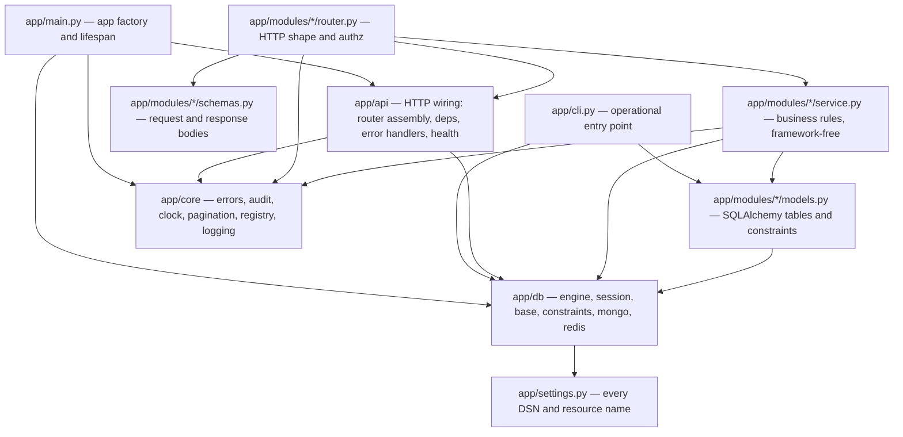
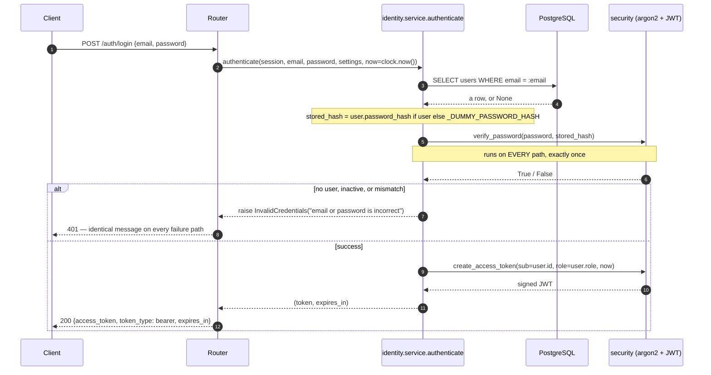
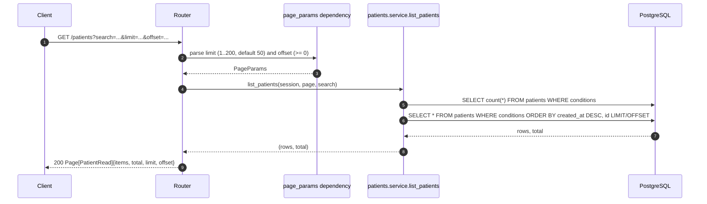
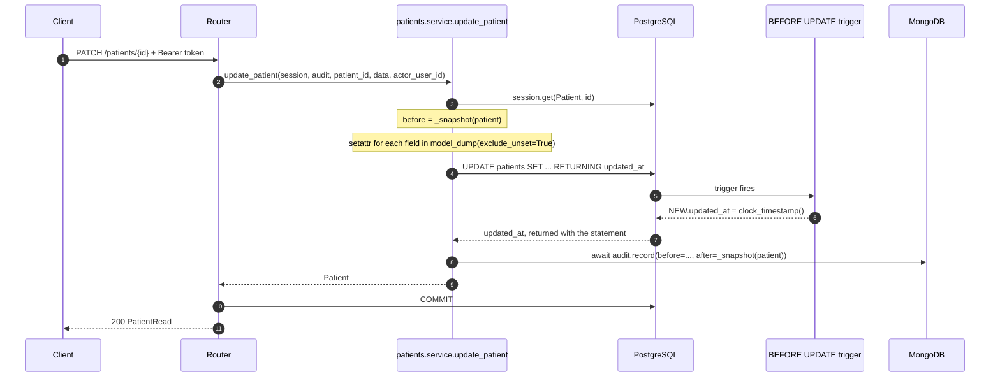
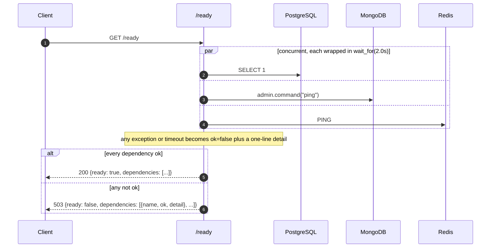
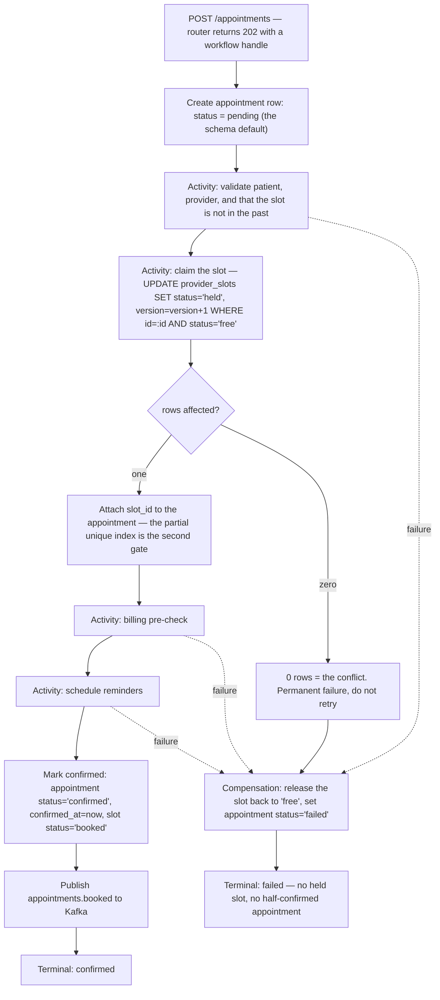
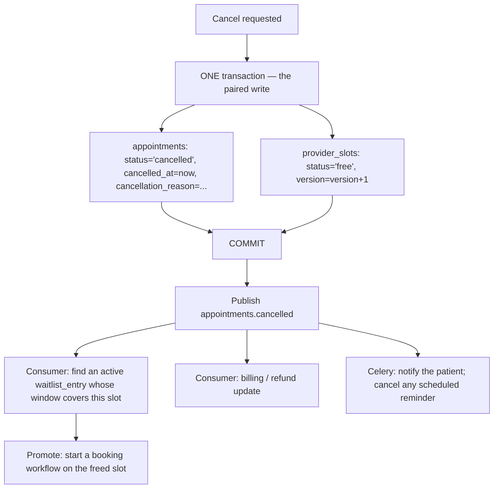

# SmartHealth — Technical Documentation

**Scope:** the submission deliverable named in
[`docs/requirements/execution-guidelines.md`](requirements/execution-guidelines.md) §3 —
service/module breakdown, data flows, event flows, key design decisions, assumptions and
tradeoffs.

**Companion documents.** [`docs/PRD.md`](PRD.md) owns requirements and traceability;
[`README.md`](../README.md) owns the orientation diagrams and how to run the thing. This
document owns the internals: what each module is for, what happens inside a request, and
how the asynchronous half of Part A is designed to work before any of it is written.

---

## Status and scope

**Week 1 of 5 is complete.** Everything in §1 and §2 describes code that exists and is
exercised by tests. **Everything in §3 is design, not code** — it is labelled as such at
the top of the section and at every subsection.

What is *not* built, stated plainly so a reviewer does not have to discover it:

| Thing | Container in compose? | Client library in `pyproject.toml`? | Code in `app/`? |
| --- | --- | --- | --- |
| PostgreSQL | yes | yes (`sqlalchemy`, `asyncpg`) | **yes** |
| MongoDB | yes | yes (`pymongo`) | **yes** — audit trail only |
| Redis | yes | yes (`redis`) | client constructed and health-checked, **used by no feature** (PRD R-7) |
| Temporal | yes (`temporal`) | **no** | **no** |
| Kafka + Schema Registry | yes (`kafka`, `schema-registry`) | **no** | **no** |
| Celery + RabbitMQ | `rabbitmq` only | **no** | **no** |
| Prometheus / Grafana / Jaeger / OpenTelemetry | **no container at all** | **no** | **no** |

Verified by `grep -rn "^from fastapi\|kafka\|celery\|temporal\|opentelemetry" app/` — the
only occurrences are in prose comments describing Week 2 and Week 3 obligations, plus
`Settings.topic()` / `queue()` / `task_queue()` (`app/settings.py:84-94`), which are the
naming helpers those systems will use when they arrive.

The three scheduling tables (`appointments`, `visits`, `waitlist_entries`) and the
`provider_slots` table exist with their constraints and migrations, and nothing reads or
writes them. That is the Week 1 / Week 2 boundary: the invariants are in the schema, the
code that must respect them is not written yet.

---

## Contents

- [1. Service / module breakdown](#1-service--module-breakdown)
  - [1.1 Dependency direction](#11-dependency-direction)
  - [1.2 The framework-free rule](#12-the-framework-free-rule)
  - [1.3 Module by module](#13-module-by-module)
- [2. Data flows](#2-data-flows)
  - [2.1 The transaction boundary rule](#21-the-transaction-boundary-rule)
  - [2.2 POST /auth/login](#22-post-authlogin)
  - [2.3 POST /patients](#23-post-patients)
  - [2.4 GET /patients — search and pagination](#24-get-patients--search-and-pagination)
  - [2.5 PATCH /patients/{id}](#25-patch-patientsid)
  - [2.6 GET /ready](#26-get-ready)
  - [2.7 Error translation](#27-error-translation)
- [3. Event flows — DESIGN, NOT BUILT](#3-event-flows--design-not-built)
  - [3.1 The three-way split](#31-the-three-way-split)
  - [3.2 The booking workflow](#32-the-booking-workflow)
  - [3.3 Cancellation and reschedule](#33-cancellation-and-reschedule)
  - [3.4 Domain event catalogue](#34-domain-event-catalogue)
  - [3.5 Idempotency](#35-idempotency)
  - [3.6 Open inconsistencies](#36-open-inconsistencies)
- [4. Key design decisions](#4-key-design-decisions)
- [5. Assumptions and tradeoffs](#5-assumptions-and-tradeoffs)

---

## 1. Service / module breakdown

SmartHealth is one deployable today: the FastAPI application (`app/main.py:45`), plus an
operational CLI (`app/cli.py`) that is deliberately not part of the request path. Week 2
and Week 3 add two more processes — a Temporal worker and a Celery worker — which is the
reason the internal layering is stricter than a single-process application would need.

Inside the deployable, modules are grouped **by domain, not by technical layer**
(`identity`, `patients`, `providers`, `scheduling`), so a feature's router, schemas,
service and models change together and live together
(`docs/superpowers/specs/2026-09-02-week1-foundation-design.md` §4).

### 1.1 Dependency direction

Dependencies point inward. Nothing in `app/core` imports anything else in `app`, except
`app/core/audit.py` importing `app/core/clock.py`.



Read the arrows as "may import". The rule that matters is the absence of the reverse
arrows: `app/core` never imports `app/modules` or `app/api`, and `app/modules/*/service.py`
never imports `app/api` or `fastapi`.

### 1.2 The framework-free rule

**`app/core/**`, `app/db/*` (except `session.py`), `app/modules/*/models.py` and every
`app/modules/*/service.py` must not import FastAPI or Starlette.** Verified — the complete
set of FastAPI imports in the application is:

```
app/api/deps.py, app/api/error_handlers.py, app/api/health.py, app/api/router.py,
app/db/session.py, app/main.py,
app/modules/identity/deps.py, app/modules/identity/router.py,
app/modules/patients/router.py, app/modules/providers/router.py
```

`app/db/session.py:7` is the one deliberate exception: it holds `get_session`, which is
itself a FastAPI dependency. The engine and session *factory* it builds
(`create_session_factory`, `app/db/session.py:11`) are framework-free and are what a
non-HTTP process uses.

**Why the rule exists.** Week 2's Temporal activities call the same service functions from
a worker process that has no ASGI stack, no `Request`, and no exception handlers. An
activity that caught `HTTPException` would be nonsense — and worse, a status code cannot
express the distinction the workflow engine actually needs: *permanent* failure ("this slot
is already taken, stop retrying") versus *retryable* failure ("the connection dropped, try
again"). Both are 409-or-500-shaped over HTTP. So services raise `DomainError` subclasses
(`app/core/errors.py:17-42`), which carry business meaning, and `app/api/error_handlers.py`
— and nothing else — maps them onto status codes. The module docstrings at
`app/core/errors.py:8-11`, `app/core/audit.py:9-17`, `app/core/pagination.py:3-11` and
`app/db/constraints.py:3-6` each record this obligation in place; PRD D-6 records the
decision.

`app/api/deps.py` exists for the same reason: it is the seam where a FastAPI `Request`
becomes a plain object. `get_audit_log` (`app/api/deps.py:27`) builds an `AuditLog` from
`request.app.state.mongo`; a Temporal activity constructs the identical `AuditLog` from a
collection and a clock with no request involved. `page_params` (`app/api/deps.py:42`) does
the same for `limit`/`offset`, so a service takes a `PageParams` value, never a
`Query`-bound parameter.

### 1.3 Module by module

#### `app/api` — HTTP wiring

**Responsibility:** everything that is true because this is an HTTP server, and would be
false in a worker process.

| File | Public surface | Notes |
| --- | --- | --- |
| `router.py:12-16` | `api_router` | The only place a module's router is mounted. |
| `deps.py:27,42` | `get_audit_log`, `page_params` | The framework / framework-free seam (§1.2). `get_audit_log` declares `clock` as a `Depends` rather than calling `get_clock()` inline, because only a declared dependency can be replaced through `app.dependency_overrides` (`app/api/deps.py:28-36`). |
| `error_handlers.py:33` | `register_error_handlers` | One handler on `DomainError` covers every subclass via Starlette's MRO walk; a second on `Exception` keeps `{"error", "detail"}` as the shape of *every* failure, including unanticipated ones. |
| `health.py:37,79` | `GET /health`, `GET /ready` | See §2.6. |

May import: `fastapi`, `app.core`, `app.db`, `app.settings`. Must not import: any
`app/modules/*/service.py` (routers do that).
**Status: implemented.**

#### `app/core` — framework-free utilities

**Responsibility:** the vocabulary every other module shares — errors, audit, time,
pagination, registries, logging — with no dependency on how the process was started.

| File | Public surface | Notes |
| --- | --- | --- |
| `errors.py:17-42` | `DomainError`, `NotFound` (404), `Conflict` (409), `PermissionDenied` (403), `InvalidCredentials` (401) | The status code is a class attribute, read only by the HTTP layer. |
| `audit.py:70-124` | `AuditEvent`, `AuditLog.record()` | Takes a `_Collection` **protocol** (`audit.py:82`), not a pymongo type, so it does not even import `app.db.mongo`. `_normalise` (`audit.py:31`) converts exactly the types BSON cannot encode and passes everything else through, so an unsupported type fails loudly rather than being silently stringified. |
| `clock.py:13-35` | `Clock`, `FixedClock`, `get_clock` | Harness requirement 6: no `datetime.utcnow()` inline anywhere. |
| `pagination.py:23-38` | `PageParams`, `Page[T]`, `MAX_LIMIT=200`, `DEFAULT_LIMIT=50` | The maximum exists so one request cannot ask for every row. |
| `registry.py:17-54` | `Registry[T]` | Harness requirement 3. Duplicate names raise, because two handlers silently claiming one name is exactly how an event gets processed twice (`registry.py:20-22`). **Currently has no registrants** — Kafka consumers, Temporal workflows and Celery tasks register here in Weeks 2–3. |
| `logging.py:19-55` | `JsonFormatter`, `configure_logging` | JSON lines. `configure_logging` removes only handlers it previously installed, never pytest's `caplog` handler (`logging.py:41-45`). OpenTelemetry trace/span ids join the record in Week 3. |

Must not import: `fastapi`, `starlette`, `app.api`, `app.modules`, `app.db`.
**Status: implemented** (`registry.py` implemented but unused).

#### `app/db` — persistence plumbing

**Responsibility:** constructing and shaping connections; not deciding anything about the
domain.

| File | Public surface | Notes |
| --- | --- | --- |
| `base.py:25-59` | `Base`, `UUIDPrimaryKeyMixin`, `TimestampMixin`, `NAMING_CONVENTION` | The naming convention is load-bearing: without it Postgres generates constraint names and Alembic diffs become unstable. `__mapper_args__ = {"eager_defaults": True}` (`base.py:39`) is the fix for the `MissingGreenlet` PATCH failure — see §2.5. |
| `engine.py:15` | `create_engine(settings)` | Lazy: builds a pool without connecting, which is what lets the contract-test lane run the real lifespan with no database present. |
| `session.py:11,21` | `create_session_factory`, `get_session` | `expire_on_commit=False`; rolls back on any exception leaving the request, so a failed request cannot leak a dirty transaction into the pool. |
| `constraints.py:17` | `violated_constraint(IntegrityError) -> str \| None` | Reads the constraint name off a failed write. Non-obvious and empirically verified: the asyncpg error carrying `constraint_name` hangs off `exc.orig.__cause__`, not `exc.orig` — matching on `exc.orig` alone turned a duplicate MRN into a 500. |
| `mongo.py:21-43` | `create_mongo_client`, `get_audit_collection`, `ensure_audit_indexes`, `AUDIT_COLLECTION` | PyMongo's async driver, not Motor (deprecated May 2026). Indexes are created by explicit tooling, not at startup, so boot needs no database. |
| `redis.py:10-26` | `create_redis_client`, `namespaced_key` | Constructed, health-checked, and **used by no feature** (PRD R-7). |
| `all_models.py:14-22` | `ALL_TABLES`, `Base` | The single import site that makes `Base.metadata` complete; without it Alembic autogenerate silently drops tables. |

Must not import: `app.modules` (except `all_models.py`, whose whole job is to import them),
`app.api`. `session.py` may import `fastapi.Request`; nothing else in `app/db` may.
**Status: implemented.**

#### `app/modules/identity` — authentication and authorisation

**Responsibility:** who is calling, and may they do this. A `User` is a login, not a person
(`models.py:1-6`).

| File | Public surface | Status |
| --- | --- | --- |
| `models.py:18-45` | `UserRole` (`patient`/`provider`/`front_desk`/`admin`), `User`, `role_column` | implemented |
| `security.py:34-102` | `hash_password`, `verify_password`, `create_access_token`, `decode_access_token`, `TokenClaims`, `InvalidToken` | implemented — pure functions over explicit inputs, no global settings and no implicit clock |
| `service.py:28` | `authenticate(session, *, email, password, settings, now)` | implemented — see §2.2 |
| `router.py:16` | `POST /auth/login` | implemented |
| `deps.py:30` | `require_role(*allowed)` | implemented — a dependency factory, so enforcement happens before the handler body runs |

`require_role` is the one place that deliberately raises `HTTPException` rather than a
domain error: it is HTTP-layer machinery and 401 has no domain meaning
(`docs/superpowers/specs/2026-09-03-week1-management-apis-design.md` §3.1). The cost is
PRD R-6 — 401/403 bodies carry `detail` but not the `error` key every other failure has.

#### `app/modules/patients` — patient records

**Responsibility:** the patient as a person receiving care, whose existence does not depend
on having credentials (`models.py:1-5`).

| File | Public surface | Status |
| --- | --- | --- |
| `models.py:19-33` | `Patient` — `mrn` unique, names, DOB, contact, nullable-unique `user_id` | implemented |
| `schemas.py` | `PatientCreate`, `PatientUpdate`, `PatientRead` | implemented. `PatientUpdate` rejects an explicit `null` on NOT NULL columns (`app/modules/patients/schemas.py:33-46`) — without it `{"first_name": null}` becomes a client-triggerable 500 instead of a 422 — and requires at least one field (`app/modules/patients/schemas.py:48-52`). |
| `service.py:54,82,98,132` | `register_patient`, `get_patient`, `list_patients`, `update_patient` | implemented |
| `router.py:30,44,54,70` | `POST /patients`, `GET /patients/{id}`, `GET /patients`, `PATCH /patients/{id}` | implemented |

Writers are `front_desk` and `admin`; readers add `provider` (`router.py:26-27`). A patient
cannot read their own record — that needs per-object rather than per-role authorisation and
is deferred with Week 2's self-service (PRD R-5).

#### `app/modules/providers` — clinics, departments, providers, slots

**Responsibility:** the supply side — who can be seen, where, and when.

| File | Public surface | Status |
| --- | --- | --- |
| `models.py:52-163` | `Clinic`, `Department`, `Provider`, `provider_departments`, `ProviderSlot`, `SlotStatus` | **models implemented; only `Provider` has a service and endpoints** |
| `service.py:54,87,103,151` | `register_provider`, `get_provider`, `list_providers`, `update_provider` | implemented |
| `router.py:35,49,59,78` | `POST /providers`, `GET /providers/{id}`, `GET /providers`, `PATCH /providers/{id}` | implemented — writes admin-only, reads open to any authenticated role |

**Clinic and department management is schema-only** (PRD `PART-A-FR-1.5`): the tables and
their constraints exist, no endpoint touches them, and they are seeded directly for now.
`ProviderSlot` is schema-only too — `status`, `version` and the GiST exclusion constraint
are in place waiting for Week 2's booking activity.

`ProviderUpdate` deliberately omits `license_number`
(`app/modules/providers/schemas.py:21-26`): it identifies the clinician to a regulator, and
changing it
silently would break the audit trail's link to a real person.

#### `app/modules/scheduling` — appointments, visits, waitlist

**Responsibility:** the booking (`Appointment`), what actually happened (`Visit`), and who
to promote when a slot frees up (`WaitlistEntry`).

**Status: schema only.** `models.py` is the module's entire contents — there is no
`service.py`, no `router.py`, no `schemas.py`. Nothing reads or writes these tables.

| Class | Notes |
| --- | --- |
| `AppointmentStatus` (`models.py:32-44`) | `pending` is the only legal initial state; `confirmed` is "reachable only after slot reservation, billing pre-check and notification scheduling have all succeeded"; `failed` records "the booking workflow failed and its compensation ran" |
| `Appointment` (`models.py:76-141`) | Carries the three constraints §3.2 depends on: the composite FK proving the slot belongs to the named provider and clinic, the composite FK proving the department belongs to the named clinic, and `CHECK (status <> 'confirmed' OR slot_id IS NOT NULL)` |
| `Visit` (`models.py:144-162`) | 1:1 with an appointment via a unique FK. Average Wait Time is `avg(seen_at - checked_in_at)` |
| `WaitlistEntry` (`models.py:165-185`) | Patient plus an optional provider/department and a time window |

#### Supporting files

| File | Responsibility | Status |
| --- | --- | --- |
| `app/settings.py:39-130` | Every DSN and every externally-visible resource name. `topic()`, `queue()`, `task_queue()` (`:84-94`) namespace Kafka/RabbitMQ/Temporal names through one prefix — harness requirement 1, so a test run can isolate itself on a shared stack. No call site may hardcode a name. | implemented; the three naming helpers have **no callers yet** |
| `app/main.py:26-52` | App factory and lifespan. Every client is lazy, so the application boots with no infrastructure running and the contract lane exercises the real startup path without Docker. | implemented |
| `app/cli.py:43-123` | `create-user`, the only way to put a login into the system outside a test fixture. Must never import `app.main` or a router (`cli.py:5-6`). | implemented |
| `migrations/versions/` | `0001_baseline` (ten tables, `btree_gist`, the GiST exclusion constraint, `ux_appointments_live_slot`, the `updated_at` trigger on nine tables), `0002_coherence_constraints` (composite FKs and `confirmed_requires_slot`), `0003_updated_at_clock_timestamp` | implemented |

---

## 2. Data flows

Everything in this section is built and running.

### 2.1 The transaction boundary rule

**The router owns the transaction; services only flush.** Every mutating handler ends with
an explicit `await session.commit()` — `app/modules/patients/router.py:40,82` and
`app/modules/providers/router.py:45,90` — and no service function commits.

This is not ceremony. It is what lets one request compose several service calls into a
single transaction, which Week 2's booking workflow requires: reserving a slot and writing
the appointment row must either both happen or neither. A service that committed on its own
would make that impossible without unpicking it later.

The corollary, recorded in both service docstrings (`app/modules/patients/service.py:6-11`):
a `Conflict` raised from inside a failed `flush()` leaves the session in "pending rollback",
where any further statement raises `PendingRollbackError`. The HTTP path is covered because
`get_session` (`app/db/session.py:29-33`) rolls back on any exception leaving the request. A
Temporal activity or Celery task owns its own session and must roll back itself.

### 2.2 POST /auth/login



**The constant-time path.** `_DUMMY_PASSWORD_HASH` (`app/modules/identity/service.py:25`) is
a real argon2 hash of a throwaway string, verified against whenever no user matches.

The timing oracle it defeats is specific. An identical error message is not sufficient,
because `or` short-circuits: written the obvious way —
`if user is None or not verify_password(...)` — an unknown address returns *before*
`verify_password` runs, while a known address pays argon2's deliberate ~55 ms. That gap is
trivially readable over a network, so response time alone would enumerate which email
addresses are registered, defeating the identical message entirely. Instead
`verify_password` runs exactly once on every path and its result is consulted afterwards
(`app/modules/identity/service.py:49-53`). The rationale is written out at
`service.py:38-47`.

Two supporting details:

- `verify_password` treats an unparseable stored hash as a failed login rather than raising
  (`app/modules/identity/security.py:38-50`), so a corrupted column cannot turn into a 500
  that leaks a stack trace and signals that *this* account differs from the others.
- `decode_access_token` disables `verify_iat` (`security.py:78-88`) because PyJWT checks
  `iat` against the wall clock with zero leeway, and a few seconds of clock skew between
  issuer and validator would reject a good token. `exp` is still fully enforced.

`is_active` is read once, at login (`service.py:52`). A deactivated user therefore keeps
access until their token expires — up to `jwt_expiry_minutes`, currently 60. That is a
deliberate deferral, recorded in the management-APIs spec §11: closing it means a database
lookup on every request, which trades away exactly the statelessness the JWT was chosen for.

### 2.3 POST /patients

```mermaid
sequenceDiagram
    autonumber
    participant C as Client
    participant R as Router
    participant A as require_role
    participant S as patients.service
    participant P as PostgreSQL
    participant M as MongoDB

    C->>R: POST /patients + Bearer token
    R->>A: require_role(front_desk, admin)
    A-->>R: TokenClaims(subject, role)
    R->>S: register_patient(session, audit, data, actor_user_id=claims.subject)
    S->>P: INSERT patients; FLUSH
    alt IntegrityError on ix_patients_mrn
        S-->>R: raise Conflict("a patient with MRN ... already exists")
        R-->>C: 409
    else flush succeeds
        S->>M: await audit.record(AuditEvent(action="registered", after=snapshot))
        M-->>S: ack
        S-->>R: Patient
        R->>P: COMMIT
        R-->>C: 201 Created
    end
```

**Why flush, then audit, then commit — in that order.**

*Flush before audit* is what makes the audit entry truthful. The flush is where the database
gets to reject the write, so `patient.id` exists and the constraints have already fired; a
duplicate MRN becomes a 409 (`app/modules/patients/service.py:63-68`) rather than an audit
entry for a patient that was never created. The constraint name is read through
`violated_constraint` (`app/db/constraints.py:17`) and compared against `ix_patients_mrn`
(`service.py:35`) — a unique *index*, not a named constraint, because `Patient.mrn` is
declared `unique=True, index=True`. Providers are genuinely asymmetric here:
`Provider.license_number` has no index, so Postgres enforces it with a named UNIQUE
constraint, `uq_providers_license_number` (`app/modules/providers/service.py:31-36`).
Anything *other* than the expected constraint is re-raised (`providers/service.py:70-73`),
so an unrelated violation surfaces as a 500 that gets investigated rather than a misleading
409.

*Awaited, not fire-and-forget.* `await audit.record(...)` (`patients/service.py:70`) means a
Mongo outage fails the request. The reasoning, at `app/core/audit.py:88-107`: a dropped
audit entry is invisible and unrecoverable, a failed request is neither.

*Audit before commit.* The two stores are not transactional with each other, so one of two
failures is unavoidable. Written this way, a failed audit write propagates, `get_session`
rolls back, and **nothing happened in either store** — the detectable failure. Reversed —
commit first, audit second — a failed audit write would leave a real mutation with nobody
recorded as having made it, which is both worse and undetectable. The residual risk (a
commit that fails *after* a successful audit write, leaving Mongo recording a change that
never took effect) is PRD **R-1**, accepted for Week 1 with the mitigation of keeping the
flush-to-commit distance minimal.

`_snapshot` (`patients/service.py:38-51`) defines the audited shape and includes `user_id`,
so a future account-linking flow reusing the function gets that field in the trail. It is
also the single place to redact from if a field ever must be excluded.

`POST /providers` is the identical flow with `admin`-only writers and the licence-number
constraint.

### 2.4 GET /patients — search and pagination



Three details, each a corrected mistake rather than a preference:

**`icontains(..., autoescape=True)`** (`app/modules/patients/service.py:113-119`). `%` and
`_` are LIKE metacharacters. Without `autoescape=True` a search for `a_b` also matches
`axb`, and a search for `%` matches every patient in the system — the same
unescaped-wildcard problem that makes `specialty` filtering use case-insensitive *equality*
rather than ILIKE on the providers side (`app/modules/providers/service.py:117-119`).
`autoescape=True` escapes `%`, `_` and the escape character itself before wrapping the term
in wildcards.

**`icontains`, not `contains`.** `contains` compiles to a plain `LIKE`, which is
case-sensitive, so "bloggs" would silently stop matching "Bloggs". `icontains` compiles to
`lower(col) LIKE lower(term) ESCAPE '/'`, giving escaping and case-insensitivity together.
The comment says "do not simplify this back to `contains`" for a reason — it was.

**The same `conditions` go to both statements**, and the sort key is `created_at DESC, id`
(`patients/service.py:121-127`). Filtering one and not the other makes `total` describe a
different result set than `items`; `created_at` alone is not unique, and offset pagination
over a non-unique sort key skips and repeats rows across pages
(`providers/service.py:136-144` spells both out).

`MAX_LIMIT = 200` (`app/core/pagination.py:23`) is enforced by the
`Query(..., le=MAX_LIMIT)` bound in `page_params` (`app/api/deps.py:42-47`), so an
out-of-range limit is a 422 before any handler runs.

### 2.5 PATCH /patients/{id}



**`eager_defaults` and the `MissingGreenlet` bug.** `updated_at` carries
`onupdate=func.now()` (`app/db/base.py:54-59`), a SQL expression, so after an UPDATE
SQLAlchemy cannot know the resulting value and expires the attribute. Reading it afterwards
— which serialising the PATCH response does — emits a lazy SELECT outside a greenlet
context and raises `MissingGreenlet`. **Every PATCH endpoint returned 500.** The fix is
`__mapper_args__ = {"eager_defaults": True}` on `Base` (`app/db/base.py:39`), which makes
SQLAlchemy append `RETURNING updated_at` to the UPDATE it already issues: no second round
trip, and no per-service `session.refresh()` for every future model to remember. It is set
on `Base` rather than on `TimestampMixin` so it also covers a future model with a server
default that does not use the mixin.

**The trigger, and why `clock_timestamp()`.** `onupdate=func.now()` is a SQLAlchemy-level
construct: verified against the live database, it fires for an ORM flush but **not** for a
raw `text("UPDATE ...")`. Week 2's slot claim is exactly such a raw conditional update, so
`migrations/versions/0001_baseline.py:207-227` installs a `BEFORE UPDATE` trigger on all
nine timestamped tables. A trigger also covers hand-written statements and data migrations,
which a coding convention cannot.

`migrations/versions/0003_updated_at_clock_timestamp.py:32-41` then changes the trigger body
from `now()` to `clock_timestamp()`. `now()` is `transaction_timestamp()` — frozen for the
whole transaction — so an update inside a long transaction was backdated to when that
transaction *began*. `updated_at` exists to record when a row actually changed, so it needs
the wall-clock instant. `created_at` deliberately keeps `now()`: creation belongs to the
logical operation, and rows inserted together sharing a timestamp is correct.

So the value returned to the client is the one the trigger wrote, not the one the ORM
guessed (`app/modules/patients/service.py:151-155`).

**Why there is no `IntegrityError` handling here**, unlike `register_patient`:
`PatientUpdate` cannot set `mrn` or `user_id`, the only uniquely-constrained columns, and
`email` has none. The comment at `service.py:143-148` states the obligation if that ever
changes — add the same translation, or the violation surfaces as a 500 instead of a 409.

### 2.6 GET /ready



The three checks run concurrently under `asyncio.gather` (`app/api/health.py:90-94`), each
individually bounded by `asyncio.wait_for(..., CHECK_TIMEOUT_SECONDS)` where the timeout is
2.0 s (`health.py:23,84`). Total latency is therefore the slowest dependency, not their sum,
and a hung dependency cannot hang the probe.

Each dependency is reported **separately** (`health.py:26-34`), because "something is down"
is far less actionable than "Mongo is down" — which matters given §2.3's decision to make
every mutation depend on Mongo. Failures are summarised to one line capped at 200 characters
(`health.py:48-51`); full tracebacks belong in logs, not in a probe response.

`/health` (`health.py:37`) stays a flat `dict[str, str]`. FastAPI enforces the return
annotation as a response model, so a nested or boolean field raises at runtime — this is why
readiness is a separate endpoint with its own Pydantic model rather than a richer `/health`.

**Known gap:** the compose healthcheck polls `/health`, not `/ready`
(`docker-compose.infra.yml`, the `app` service's `healthcheck`), so the container keeps
reporting healthy while every request fails on a downed Postgres. Deliberate — `--wait` uses
the healthcheck as a startup gate, and a readiness-based gate would make startup depend on
dependencies `depends_on: service_healthy` has already gated (management-APIs spec §11).

### 2.7 Error translation

Two handlers, registered in `app/api/error_handlers.py:33-77`:

| Raised | Response |
| --- | --- |
| any `DomainError` subclass | `exc.status_code` with `{"error": "<ClassName>", "detail": "<message>"}` |
| any other `Exception` | 500 with `{"error": "InternalError", "detail": "an unexpected error occurred"}` |

One registration on the base class covers every subclass, because Starlette resolves
handlers by walking the raised exception's MRO (`error_handlers.py:34-38`).

The `Exception` handler exists so the `{"error", "detail"}` shape survives the failures
nobody anticipated — without it, an unhandled exception falls through to Starlette's own
500, which answers `{"detail": "Internal Server Error"}` and no `error` key, breaking a
client's uniform error parsing on precisely the failure that is hardest to reproduce. The
body says nothing deliberately: `str(exc)` on an unexpected failure routinely carries a DSN
with credentials or the row data that broke a constraint (`error_handlers.py:27-30`). The
text goes to the log with a traceback instead.

Two documented limits: `HTTPException` is handled separately by Starlette, so FastAPI's 404s
and 422s keep their own shapes (which is why `require_role`'s 401/403 lack the `error` key —
PRD R-6); and a `DomainError` raised inside a `StreamingResponse` body runs after the
response has started and is not caught, which Part B's streaming responses will have to
handle themselves (`error_handlers.py:9-13`).

---

## 3. Event flows — DESIGN, NOT BUILT

> **Nothing in this section exists in code.** There is no Kafka producer or consumer, no
> Celery task, no Temporal workflow or activity, and no client library for any of the three
> in `pyproject.toml`. `app/core/registry.py` — the registry those components will register
> into — has zero registrants. `Settings.topic()`, `Settings.queue()` and
> `Settings.task_queue()` have zero callers.
>
> What follows is the design, its rationale, and the constraints already in the database
> that will police it. It is written now because the Week 1 schema was shaped by it: the
> `pending` default, the `failed` status, `provider_slots.version`, `rescheduled_from_id`
> and `waitlist_entries` are all here for flows that do not yet run.
>
> **Scheduled:** booking and visit workflows in Week 2; Kafka, Celery and observability in
> Week 3 (PRD §10).

### 3.1 The three-way split

The assignment mandates Temporal, Kafka and Celery/RabbitMQ. `CLAUDE.md` states that
"reaching for the wrong one of these three is the most likely architectural mistake in this
project", and PRD **D-7** records the split as a decision. This is the reasoning.

| | **Temporal** | **Kafka (+ Schema Registry)** | **Celery + RabbitMQ** |
| --- | --- | --- | --- |
| **Owns** | Durable multi-step *business* workflows: booking, cancel/reschedule, the visit lifecycle, provider deactivation | Domain events carried *between* modules: something happened, and other modules may care | Fire-and-forget background jobs: notification delivery, analytics rollups, slot generation |
| **Guarantees** | Durable execution state, automatic retry per activity, compensation on failure, deterministic replay after a crash, time-skipping in tests | Durable ordered log, replayable from an offset, many independent consumers, schema-enforced payloads | A job runs, eventually, with retry and a dead-letter path |
| **Costs** | A worker process, workflow-determinism constraints on the code, operational surface | Eventual consistency, at-least-once delivery, a schema to version, consumer lag to monitor | No ordering, no cross-job state, no compensation — a failed job is just a failed job |
| **Failure from misusing it** | *Booking as a Celery task:* there is no durable state between steps, so a worker crash after slot reservation and before billing leaves a held slot and a `pending` appointment that nothing will ever finish or compensate. Retrying the task re-runs steps that already succeeded. | *Request-scoped work over Kafka:* the caller must either block on a reply topic or return before the work is done. It adds a network hop, a serialisation round-trip and consumer lag to something that was a function call — latency for no benefit, and the failure is now asynchronous and invisible to the caller. | *A reminder as a Temporal workflow:* a workflow history, a task queue and a worker slot to send one SMS that is allowed to fail and be retried. Correct, and needless overhead at the volume of reminders a clinic network sends. |

The discriminating questions, in order:

1. **Does partial failure need compensating?** If yes, Temporal. Booking either completes or
   must undo the slot it held. Nothing else in the stack can express "undo step 2".
2. **Does anyone other than the caller need to know?** If yes, Kafka. Analytics does not
   want to be called by the booking workflow; it wants to consume `appointments.booked` and
   stay decoupled from it.
3. **Otherwise**, Celery: work that must not hold the request, whose failure is survivable
   and retryable in isolation.

The three compose rather than compete. The booking workflow (Temporal) publishes
`appointments.booked` (Kafka) as its last step; a consumer of that event enqueues reminder
delivery (Celery). Each mechanism does the one thing it is good at.

### 3.2 The booking workflow

> **Design. Not implemented.** The tables and constraints exist; the workflow does not.

The assignment's headline requirement: *"appointment marked confirmed only after successful
processing"*, and *"partial failures must not corrupt the scheduling state"*
(`docs/requirements/part-a-core-platform.md` §2; PRD `PART-A-FR-2`).



**`confirmed` is unreachable early, structurally.** Three things already in the database
enforce this independently of whether the workflow above is written correctly:

| Guarantee | Where | What it stops |
| --- | --- | --- |
| `appointments.status` defaults to `'pending'` | `app/modules/scheduling/models.py:99-101`; `0001_baseline.py` | An insert that forgets to set a status cannot create a confirmed appointment |
| `CHECK (status <> 'confirmed' OR slot_id IS NOT NULL)` — `ck_appointments_confirmed_requires_slot` | `models.py:137-140`; `0002_coherence_constraints.py:75-84` | A confirmed appointment that never claimed a slot. Confirmation is only legal *after* reservation succeeded |
| `ux_appointments_live_slot` — `CREATE UNIQUE INDEX ... ON appointments (slot_id) WHERE status IN ('pending','confirmed') AND slot_id IS NOT NULL` | `0001_baseline.py:194-202` | Two live appointments holding one slot, **even if the conditional UPDATE is buggy**. Partial, so cancelling frees the slot again |

Two further constraints make a claim *coherent* rather than merely non-conflicting
(`0002_coherence_constraints.py:45-70`): `fk_appointments_slot_provider_clinic` proves the
slot really belongs to the provider and clinic the appointment names, and
`fk_appointments_department_clinic` proves the department belongs to that clinic. Every
single-column FK can be satisfied while the booking is still nonsense; these catch that. The
composite FK is MATCH SIMPLE, so it is skipped while `slot_id` is NULL (pre-claim) and
enforced the instant a slot is attached (`models.py:117-128`).

On the supply side, `ck_provider_slots_no_overlap` —
`EXCLUDE USING gist (provider_id WITH =, tstzrange(starts_at, ends_at) WITH &&)`
(`0001_baseline.py:180-189`) — means a buggy slot generator fails loudly at write time
instead of silently producing double-bookable inventory.

**Why zero rows affected is the design.** PRD **D-2**: computing availability from working
hours at request time means two concurrent requests both compute "free" and both book. With
pre-generated rows, the claim is a single atomic conditional UPDATE and there is no window
between checking and acting — zero rows affected *is* the conflict signal, and it is a
**permanent** failure the workflow must not retry. This is precisely the distinction a
service function can express with a `Conflict` domain error and an HTTP status cannot
(§1.2).

**Three obligations the schema cannot carry** (PRD R-2, R-3, R-4; foundation spec §5.3):

1. The claim statement must say `version = version + 1`. Nothing increments
   `provider_slots.version` automatically (`app/modules/providers/models.py:145-146`), so
   written as a bare status flip the column is decoration.
2. The workflow must reject a slot whose `starts_at` has passed. `CHECK (starts_at > now())`
   is impossible — Postgres requires check conditions to be immutable.
3. Releasing a slot is a paired write — see §3.3.

**Why the router should return 202, not 201.** The booking is `pending` when the request
returns; confirmation happens when the workflow completes. A 201 would claim a resource in a
state it is not yet in. The harness case sketch already assumes this shape
(`docs/superpowers/specs/2026-09-01-testing-harness-design.md` §7.1: `expect: {status: 202}`
followed by `await: {workflow: BookAppointment, state: completed}`).

### 3.3 Cancellation and reschedule

> **Design. Not implemented.**

`CLAUDE.md` and the requirements both treat these as **first-class flows, not the inverse of
booking**: cancelling triggers slot release, waitlist movement, refund/billing updates and
notifications — work booking never does.



Reschedule is the same shape plus an insert: a **new** appointment row with
`rescheduled_from_id` pointing at the old one, which moves to `rescheduled`
(`app/modules/scheduling/models.py:39-40,103-106`). History is preserved, because the audit
trail and analytics both need it.

#### Releasing a slot is a PAIRED WRITE — PRD R-2

This is the single most dangerous latent bug in the current schema, and it is worth stating
precisely because the failure is silent.

`provider_slots.status` and appointment *liveness* are two independently writable facts.
Verified during the foundation slice (foundation spec §5.3): moving an appointment to
`rescheduled` or `cancelled` takes it out of `('pending','confirmed')` and therefore frees
it from `ux_appointments_live_slot` — a second appointment may immediately claim that
`slot_id`. But the slot's own `status` is untouched and stays `booked`.

The consequence is not a crash. It is that **the slot never reappears in the
`status = 'free'` query that booking actually uses**. The inventory silently shrinks, one
slot per cancellation, forever. Nothing in the database detects it, because neither fact is
individually wrong.

Therefore: **every cancel, reschedule, no-show and completion path must flip the appointment
status and release the slot in one transaction.** All four — not just cancel. This deserves
an explicit integration test, not a convention; and the harness's post-condition invariant
registry already lists "no reserved slot without a corresponding non-cancelled appointment"
as a check that runs after *every* journey case
(`docs/superpowers/specs/2026-09-01-testing-harness-design.md` §7.5), which is how a
regression here gets caught retroactively across the whole suite.

This is also why §2.1's rule matters: the router owns the commit, so two service calls
compose into one transaction.

### 3.4 Domain event catalogue

> **Design. No topic exists and no producer or consumer is written.**

`docs/requirements/part-a-core-platform.md` §4 names seven event categories. The table below
maps each to a producer, consumers, and a payload sketch.

**Naming caveat:** the only topic name written down anywhere in the repository is
`appointments.booked`, in the harness design's example case
(`2026-09-01-testing-harness-design.md` §7.1). The rest follow its `<entity>.<past-tense>`
convention but are proposed here, not previously decided. Every one of them must be
constructed through `Settings.topic()` (`app/settings.py:84-86`) — harness requirement 1
namespaces a shared stack through that prefix, so a literal at the call site breaks test
isolation.

| Topic | Producer | Consumers | Payload sketch |
| --- | --- | --- | --- |
| `appointments.booked` | Booking workflow (Temporal), final step | analytics rollup; notification scheduler; (Part B) ingestion | `{event_id, appointment_id, patient_id, provider_id, clinic_id, department_id, slot_id, starts_at, booked_at}` |
| `appointments.cancelled` | Cancellation flow | waitlist promoter; billing/refund; notifications; analytics (cancellation rate) | `{event_id, appointment_id, slot_id, patient_id, provider_id, cancelled_at, reason, initiated_by}` |
| `appointments.rescheduled` | Reschedule flow | waitlist promoter; notifications; analytics | `{event_id, old_appointment_id, new_appointment_id, old_slot_id, new_slot_id, patient_id, rescheduled_at}` |
| `providers.schedule_changed` | Slot generation / provider availability edit | availability cache invalidation (Redis, PRD R-7); waitlist promoter; notifications for affected bookings | `{event_id, provider_id, clinic_id, affected_window: {from, to}, slots_added, slots_removed, changed_at}` |
| `notifications.reminder_due` | Scheduler — Celery beat or a Temporal cron workflow, undecided (foundation spec §10) | notification dispatcher (Celery) | `{event_id, appointment_id, patient_id, channel, send_at, template}` |
| `billing.status_updated` | Billing pre-check / refund activities | appointment status projection; notifications; analytics | `{event_id, appointment_id, patient_id, billing_status, amount, updated_at}` |
| `visits.completed` | Visit workflow (Temporal) | analytics (Completed Visits, Average Wait Time); follow-up scheduler; billing | `{event_id, visit_id, appointment_id, patient_id, provider_id, checked_in_at, seen_at, completed_at}` |
| analytics processing | — | Analytics is modelled as a **consumer** of the above, not a producer of its own events | — |

Every payload carries `event_id`. See §3.5.

The five analytics metrics (`PART-A-FR-5`) are all derivable from this catalogue against the
existing schema: Total Patients from `patients`; Appointments Booked Over Time from
`appointments.booked`; Completed Visits and Average Wait Time from `visits.completed`
(`avg(seen_at - checked_in_at)`, which is exactly why a visit is a separate entity — PRD
D-3); Cancellation Rate from `appointments.cancelled` against `appointments.booked`.

**Two things deliberately not designed yet**, because guessing would guarantee a rewrite:

- **The outbox.** Publishing to Kafka inside the same transaction as the business write is
  not atomic, which is the same class of problem as PRD R-1. The standard answer is a
  transactional outbox table, and the foundation spec §2 explicitly defers it: *"No Kafka
  `outbox` table. It lands with the producer in Week 3."* The harness already lists "no
  outbox row left unpublished" among its post-condition invariants (§7.5), so the shape is
  anticipated; the table is not designed.
- **`billing_records`.** Deferred for the same reason (foundation spec §2): its shape
  follows the billing pre-check activity, and inventing columns now guarantees a rewrite.
  Billing is a pre-check and a status, not a payment gateway (PRD §2, non-goals).

### 3.5 Idempotency

> **Design. No consumer exists to be idempotent.**

**Every consumer assumes at-least-once delivery and takes an explicit idempotency key.**
This is harness requirement 4 (`CLAUDE.md`; `2026-09-01-testing-harness-design.md` §6.4):
*"Consumers accept an explicit idempotency key surface (event id / dedupe key), rather than
inferring uniqueness ad hoc."* PRD **PART-A-NFR-3** states it as a requirement.

The word *explicit* is the whole point. Inferring uniqueness ad hoc — "we will dedupe on
appointment_id and timestamp" — works until two legitimate events for one appointment
collide, at which point the consumer silently drops a real event. A dedicated `event_id`
carried on the envelope, and checked against a store before the side effect, has one meaning
and one failure mode.

**What goes wrong without it.** Kafka, RabbitMQ and Temporal all deliver at least once;
redelivery after a consumer crash between the side effect and the acknowledgement is normal
operation, not an edge case.

- A duplicated `visits.completed` double-counts **Completed Visits** and corrupts **Average
  Wait Time** — and analytics is the one surface where nobody notices a wrong number until
  someone acts on it.
- A duplicated `billing.status_updated` double-bills a patient.
- A duplicated `notifications.reminder_due` sends the same patient the same reminder twice.

Only the third is merely embarrassing.

**How it is enforced, not merely intended.** Registration in `app/core/registry.py` is what
makes the property testable in bulk: every Kafka consumer, Temporal workflow and Celery task
registers, and the meta-tests enumerate the registry rather than a hand-maintained list that
drifts (`2026-09-01-testing-harness-design.md` §8):

| Meta-test | Enumerates | Asserts |
| --- | --- | --- |
| `test_consumers_idempotent.py` | every registered Kafka consumer | delivering its event **twice** yields exactly one side effect |
| `test_tasks_idempotent.py` | every Celery task | re-execution with the same key is a no-op |

A new consumer added without idempotency fails the suite the day it lands. The registry
raising on duplicate names (`app/core/registry.py:28-32`) closes the other half of the same
hole: two handlers silently claiming one name is itself a way to process an event twice.

Temporal is a partial exception worth naming: activities are retried by the engine and must
be idempotent for the same reason, but workflow *execution* is deduplicated by workflow id,
so submitting the same booking twice under a deterministic id is safe by construction. That
is a property to use, not a reason to skip idempotent activities.

### 3.6 Open inconsistencies

Recorded rather than quietly resolved, because both affect Week 2:

1. ~~**`pending_failed` vs `failed`.**~~ **Resolved 2026-09-13.** The harness design's
   failure-sibling case expected `appointments.status == pending_failed`
   (`2026-09-01-testing-harness-design.md` §7.1), but `AppointmentStatus` has no such member
   — it has `failed` (`app/modules/scheduling/models.py:44`), and that is the only value the
   CHECK constraint accepts. **The code was authoritative and the spec has been corrected**;
   the sketch now reads `failed`. Left recorded rather than deleted, because a Week 2 test
   written from an older copy of that spec would still fail confusingly.
2. **Slot generation cadence is undecided** — a Celery beat job versus a Temporal cron
   workflow (foundation spec §10). Deferred deliberately: the table shape is unaffected
   either way. It is the one place where §3.1's decision procedure does not yet give an
   obvious answer, because slot generation is both periodic (Celery-shaped) and multi-step
   across a provider's availability rules (Temporal-shaped).

---

## 4. Key design decisions

Seven decisions are recorded with their rejected alternatives and rationale in
**[PRD §8](PRD.md#8-key-design-decisions)** (D-1 … D-7), with full derivations in
[`2026-09-02-week1-foundation-design.md`](superpowers/specs/2026-09-02-week1-foundation-design.md)
§3 and
[`2026-09-03-week1-management-apis-design.md`](superpowers/specs/2026-09-03-week1-management-apis-design.md).
In summary: a user account is distinct from a patient/provider record (D-1); bookable time
is a pre-generated row rather than a computation (D-2); an appointment is separate from a
visit (D-3); PostgreSQL is the system of record and MongoDB owns only the audit trail (D-4);
reliability invariants live in database constraints rather than application code (D-5);
services never import FastAPI and routers own the transaction boundary (D-6); and Temporal,
Kafka and Celery each own one kind of asynchronous work (D-7). This document shows where
each lands in the code — D-5 and D-6 in §1 and §2, D-2, D-3 and D-7 in §3.

## 5. Assumptions and tradeoffs

Seven known gaps and accepted risks are recorded, each with a status, in
**[PRD §9](PRD.md#9-known-gaps-and-accepted-risks)** (R-1 … R-7): the non-atomic
audit/commit pair (R-1), the paired slot release (R-2), bookable past slots (R-3), the
non-self-incrementing `version` column (R-4), the missing patient self-access (R-5), the
error-contract inconsistency on 401/403 (R-6), and Redis being connected but unused (R-7).
R-1 is explained in situ at §2.3, R-2 at §3.3, and R-3/R-4 at §3.2.

Further deferrals that are decisions rather than oversights — a deactivated user keeping
access until token expiry, `list_providers` having no `is_active` filter, provider
deactivation ignoring future appointments, specialty filtering being a sequential scan,
entrypoint migrations racing under multiple replicas, the healthcheck polling `/health`
rather than `/ready`, and the absence of a dependency lock file — are each written up with
their reasoning in
[`2026-09-03-week1-management-apis-design.md`](superpowers/specs/2026-09-03-week1-management-apis-design.md)
§11.
